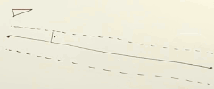
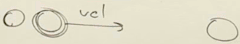

# Autonomous Agents and Steering


[red3d cwr steer](http://www.red3d.com/cwr/steer/)

[Steering Behaviors For Autonomous Characters](http://www.red3d.com/cwr/steer/gdc99/)


## 1: Autonomous Agents and Steering

- Autonomous Agent
    - has **limited** ability to perceive its environment
        - e.g. can perceive anything with 25 pixel of itself , or only to see things that are in its field of view.
    - process the environment, **calculate an action**, it's going to result a **force**.
    - no global plan , or leader
- Vehicles
    - action/selection
        - desire velocity
    - steering
        - calculate a steering force based on desire velocity
    - locmotion
        - physics simulation

## 2: Steering Behaviors: Seek

- `steering = desired - velocity`
- Pseudo Seek Code
    ```java
    PVector desired = PVector.sub( target, location );
    // normalized first, and multiply `maxSpeed`
    desired.SetMag( maxSpeed );

    PVector steering = PVector.sub( desired - velocity );
    steering.limit( maxForce ); // not SetMag !!

    applyForce( steering );
    ```
- Vehicle
    ```java
    class Vehicle {
        float maxspeed;
        // how good is it at turning
        float maxforce;
    }
    ```
- simple seek, but this implementation has weird behavior, it's always sort of flying past the target and then it has to turn aroud and turn back.
    - we will solve this problem by introducing the `arriving` behavior what it means for that vehicle to slow down and stop when it reaches the target. We're going to change the desired velocity so that the closer to the target the smaller it is. That is, when I'm close to the target, I desire to be moving very very slowly at that point. 


<details>
<summary>
Seek
</summary>

```java
// Seeking "vehicle" follows the mouse position

// Implements Craig Reynold's autonomous steering behaviors
// One vehicle "seeks"
// See: http://www.red3d.com/cwr/

Vehicle v;

void setup() {
  size(640, 360);
  v = new Vehicle(width/2, height/2);
}

void draw() {
  background(255);

  PVector mouse = new PVector(mouseX, mouseY);

  // Draw an ellipse at the mouse position
  fill(200);
  stroke(0);
  strokeWeight(2);
  ellipse(mouse.x, mouse.y, 48, 48);

  // Call the appropriate steering behaviors for our agents
  v.seek(mouse);
  v.update();
  v.display();
}

```

</details>


<details>
<summary>
Vehicle Class
</summary>

```java
// Seek_Arrive

// The "Vehicle" class
class Vehicle {
  
  PVector position;
  PVector velocity;
  PVector acceleration;
  float r;
  float maxforce;    // Maximum steering force
  float maxspeed;    // Maximum speed

  Vehicle(float x, float y) {
    acceleration = new PVector(0,0);
    velocity = new PVector(0,-2);
    position = new PVector(x,y);
    r = 6;
    maxspeed = 4;
    maxforce = 0.1;
  }

  // Method to update position
  void update() {
    // Update velocity
    velocity.add(acceleration);
    // Limit speed
    velocity.limit(maxspeed);
    position.add(velocity);
    // Reset accelerationelertion to 0 each cycle
    acceleration.mult(0);
  }

  void applyForce(PVector force) {
    // We could add mass here if we want A = F / M
    acceleration.add(force);
  }

  // A method that calculates a steering force towards a target
  // STEER = DESIRED MINUS VELOCITY
  void seek(PVector target) {
    PVector desired = PVector.sub(target,position);  // A vector pointing from the position to the target
    
    // Scale to maximum speed
    desired.setMag(maxspeed);

    // Steering = Desired minus velocity
    PVector steer = PVector.sub(desired,velocity);
    steer.limit(maxforce);  // Limit to maximum steering force

    applyForce(steer);
  }

  void display() {
    // Draw a triangle rotated in the direction of velocity
    float theta = velocity.heading2D() + PI/2;
    fill(127);
    stroke(0);
    strokeWeight(1);
    pushMatrix();
    translate(position.x,position.y);
    rotate(theta);
    beginShape();
    vertex(0, -r*2);
    vertex(-r, r*2);
    vertex(r, r*2);
    endShape(CLOSE);
    popMatrix();
  }
}
```

</details>

- The opposite behavoir against seek is **flee**.

## 3: Steering Behaviors: Arrive

- If I'm close to the target maybe I want my desired velocity to be not so fast. And if I'm on the target, my desired velocity should be zero. So how to do it ?
- one way that we can do it is we can think of the target as having an invisible circle around it, with some radius , let's say 100 , and when the vehicle is anywhere outside of the target's circle, its desired velocity magnitude is maximum speed. 
    - now when its right on the edge it still desires to go in max speed.
    - when it is right on the target, it desires its magnitude is 0.
    - when it is halfway in between circle edge and the target, it desires its magnitude is `maxspeed/2`.
    ```java
    float distance = PVector.dist( myLocaltion, target );
    float speed = map( distance, 0, 100 , 0, maxspeed );
    ```
    - this is a really fantastic solution and works very well. But the real question isn't just to say that this model is that what you should use. It's this way of thinking. 


<details>
<summary>
arrive()
</summary>

```java
  // deprecate seek(), use arrive() instead

  // A method that calculates a steering force towards a target
  // STEER = DESIRED MINUS VELOCITY
  void arrive(PVector target) {
    PVector desired = PVector.sub(target,position);  // A vector pointing from the position to the target
    float d = desired.mag();
    // Scale with arbitrary damping within 100 pixels
    if (d < 100) {
      float m = map(d,0,100,0,maxspeed);
      desired.setMag(m);
    } else {
      desired.setMag(maxspeed);
    }

    // Steering = Desired minus Velocity
    PVector steer = PVector.sub(desired,velocity);
    steer.limit(maxforce);  // Limit to maximum steering force
    applyForce(steer);
  }
```

</details>


with `Arrive`, we can make the vehicle do something behavior like *staying within valls*.

<details>
<summary>
staying within valls: boundaries()
</summary>

```java
  void boundaries() {
    // d = 25;
    PVector desired = null;

    if (position.x < d) {
      desired = new PVector(maxspeed, velocity.y);
    } 
    else if (position.x > width -d) {
      desired = new PVector(-maxspeed, velocity.y);
    } 

    if (position.y < d) {
      desired = new PVector(velocity.x, maxspeed);
    } 
    else if (position.y > height-d) {
      desired = new PVector(velocity.x, -maxspeed);
    } 

    if (desired != null) {
      desired.normalize();
      desired.mult(maxspeed);
      PVector steer = PVector.sub(desired, velocity);
      steer.limit(maxforce);
      applyForce(steer);
    }
  }  
```

</details>

---

- What if the target happens to be a vehicle and it's moving as well, and you're seeking it.
    - this behavior is called `pursuit`.
    - I know the target's velocity, I can predict that in a few moments where it's going to be.
    - and my desired velocity shouldn't be pointed towards its current location , it should be pointed towards where I believe its future location is going to be.


## 6: Steering Behaviors: Path Following - The Nature of Code

[Path Following reading](https://natureofcode.com/book/chapter-6-autonomous-agents/#chapter06_section8)

- steering behavior where a vehicle is attempting to stay on path
- scenario: a path with radius
    - the path radius is the distance from the line, kind of the width of the path
    - we drop a vehicle into this world with the path
    - 
    - we can clearly see this vehicle is off the path
- So one of the things that's important in the steering behavior is to understand is the vehicle is already on the path or is it off the path. And acutally we're gonna take that one step further. 
    1. Check vehicle's further location
    2. Is that further location is on the path? Is it within the radius of the path? ( length of the error vecto `<` raidus )
        - if yes, do nothing
        - if no, go step 3
    3. find the cloest point to the path. ( the projection point )
        - if the path is combined with multiple segments, you will have many projection projection points, pick the smallest one if the projection point is still on the path segment( not on their extension line)
    4. move along the path a little bit. 
        - that is , we don't actual use the projection point, we move a bit further along the path accroding our current velocity.
        - and this is our target !
        - 
    5. Seek that target.


[vehicle follow code](https://github.com/nature-of-code/noc-examples-processing/blob/master/chp06_agents/NOC_6_06_PathFollowing/Vehicle.pde)


## 7: Group Steering Behaviors - The Nature of Code

- to have a steering behavior where the desired velocity is determined based on the behavior of other neighbor vehicles.

###  alignment behavior

- alignment means my desired velocity is the velocity of my neighbors. I want align my speed and direction with how my neighbors are moving, that is, the average velocity of all heighbors.
- align with unlimited vision (all vehicle are neighbors)
    - 
- align with limit vision
    - 


### Separate

- Separate behavior 
    - desired velocity is the average of **flee** velocities.
        - 
    - we could actually weight the length of that flee vector. 
        - We can scale the vector that's pointing away from the other vehicle it's too close.
        - 
    - please NOTE, this is NOT collision avoidance.
        - for an example
            - 
            - separation algorithm will cause this vehicle to really want to get away from the left vehicle, more than the right one. Obviously it's gonna get closer to right one.
            - a collision avoidance algorithm might look at where it's going and completely ignore the left one which is behind it.

[separation code](https://github.com/nature-of-code/noc-examples-processing/tree/master/chp06_agents/NOC_6_07_Separation)

### Cohesion

- cohesion is my desired velocity is a vector that points towards the average location of all of my neighbors.
    - 


## 8: Combining Steering Behaviors: Flocking

- in our first demonstration what I'm going to do is combining `seek` and `separate`.
    ```java
    applyForce(seek);
    applyForce(seprate);
    ```
    - that will in fact work. BUT one thing we should add on to this is a rule that governs how you combine these forces , a **weight**.
    - 
    - [seek and separate code](https://github.com/nature-of-code/noc-examples-processing/tree/master/chp06_agents/NOC_6_08_SeparationAndSeek)
    ```java
    void applyBehaviors(ArrayList<Vehicle> vehicles) {
        PVector separateForce = separate(vehicles);
        PVector seekForce = seek(new PVector(mouseX,mouseY));
        // crucial, weight
        // admittedly this is probably the worst possible
        // way even to do this... hard code 
        separateForce.mult(2);
        seekForce.mult(1);
        applyForce(separateForce);
        applyForce(seekForce); 
    }    
    ```


### Flocking

- separaton  + alignment + cohesion
    - [flocking code](https://github.com/nature-of-code/noc-examples-processing/tree/master/chp06_agents/NOC_6_09_Flocking)


